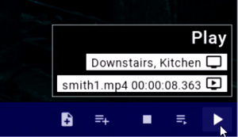

## Membrane Control

A GUI application for Microsoft Windows, macOS, and Linux, using the [SDL](https://www.libsdl.org/) cross-platform development library. Its primary purpose is access and command of functions provided by [Membrane Server](https://membranesoftware.com/membrane-server) applications: [Membrane Media Library](https://membranesoftware.com/membrane-media-library), [Membrane Monitor](https://membranesoftware.com/membrane-monitor), [Membrane Camera](https://membranesoftware.com/membrane-camera)

   

Builds: https://membranesoftware.com/membrane-control/

About Membrane Control: https://membranesoftware.com/i/about-membrane-control
